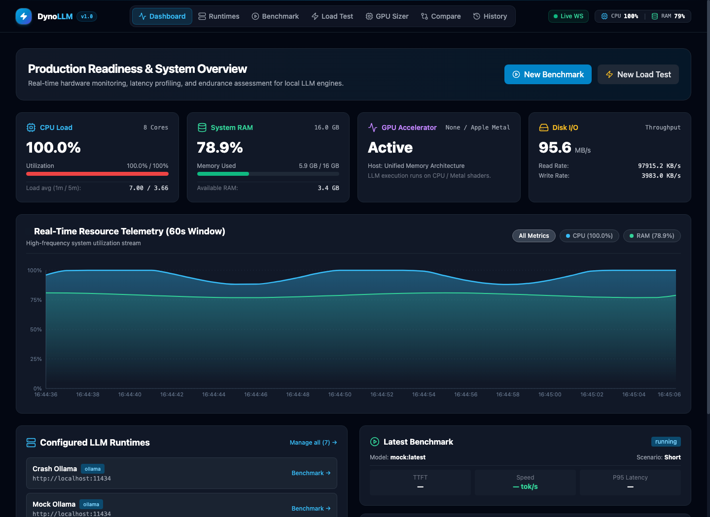

# ⚡ DynoLLM

**DynoLLM** is an open-source benchmarking, concurrent load testing, and real-time hardware telemetry platform for local LLMs (Ollama, vLLM, LM Studio, and llama.cpp). Profile Time-To-First-Token (TTFT), tokens/second throughput, concurrency saturation limits, and GPU VRAM/wattage in a modern real-time web dashboard.

<div align="center">

[](LICENSE)
[](https://python.org)
[](https://fastapi.tiangolo.com)
[](https://reactjs.org)
[](https://tailwindcss.com)
[](.github/workflows/ci.yml)

**Answer the ultimate deployment question:**

> _"Can this local LLM configuration safely and reliably serve my production workload, and how many concurrent users can it handle before latency collapses?"_

</div>

---

## 📑 Table of Contents

- [Why DynoLLM? (Comparison)](#-why-dynollm)
- [Interactive Dashboard Preview](#-dashboard-preview)
- [Key Features](#-key-features)
- [High-Level Architecture](#️-high-level-architecture)
- [Quick Start](#️-quick-start)
- [Environment Configuration](#%EF%B8%8F-environment-configuration)
- [Project Structure](#-project-structure)
- [API Reference Summary](#-api-reference-summary)
- [Benchmark Parameters](#-benchmark-parameters)
- [Load Test Parameters](#-load-test-parameters)
- [WebSocket Events](#-websocket-events)
- [Usage Examples (cURL)](#-usage-examples-curl)
- [Documentation & Deep Dive](#-documentation)
- [Testing](#-testing)
- [Contributing](#-contributing)
- [License](#-license)

---

## 🥊 Why DynoLLM?

Generic HTTP load testers (like k6, Locust, or Apache Bench) measure raw request roundtrips, but fail to capture the nuances of streaming generative AI: chunk intervals, Time-To-First-Token (TTFT), GPU memory saturation, and context-window degradation. DynoLLM is built from the ground up specifically for Local LLM operations (LLMOps).

| Capability / Metric                     |                ⚡ DynoLLM                 |        k6 / Locust         |    curl / Custom Scripts    |     lm-evaluation-harness      |
| --------------------------------------- | :---------------------------------------: | :------------------------: | :-------------------------: | :----------------------------: |
| **Streaming TTFT & Tok/s Metrics**      |    **Native** (chunk-level resolution)    |  ❌ Raw HTTP latency only  |  ❌ Manual parsing needed   | ❌ Offline batch scoring only  |
| **Hardware Telemetry (GPU/VRAM/Power)** |  **Real-Time** (NVIDIA + Apple Silicon)   | ❌ External tool required  |           ❌ None           |            ❌ None             |
| **Tokens-per-Watt Energy Profiling**    | **Automatic** ($\text{tok/s} / \text{W}$) |           ❌ No            |            ❌ No            |             ❌ No              |
| **Runtime Crash & OOM Watchdog**        |      **Auto-Abort** (safe teardown)       |    ❌ Hangs / timeouts     | ❌ Hard crash / hung socket |             ❌ No              |
| **Pre-built LLM Scenarios**             |   **Yes** (RAG, JSON, Multi-turn, Code)   | ❌ Must write from scratch |   ❌ Fragile bash scripts   | ⚠️ Quality/accuracy benchmarks |
| **Interactive Web UI Dashboard**        |      **Zero-config** React dashboard      |  ⚠️ Grafana / CLI export   |   ❌ Terminal stdout only   |     ⚠️ Static HTML reports     |
| **Universal Local Runtime Support**     |  **Ollama, vLLM, LM Studio, llama.cpp**   | ⚠️ Generic HTTP endpoints  |   ⚠️ Manual curl configs    |      ⚠️ Library bindings       |

---

## 🖥️ Dashboard Preview

<div align="center">
  
</div>

<details>
<summary><b>View ASCII Terminal Wireframe</b></summary>

```text
 ┌──────────────────────────────────────────────────────────────────────────────────┐
 │  ⚡ DynoLLM Dashboard   [Active Runtime: Ollama / vLLM]   [Hardware: NVIDIA RTX]  │
 ├──────────────────────────────────────────────────────────────────────────────────┤
 │  Model: llama3.1:8b-instruct-q4_K_M       Status: ● RUNNING STRESS TEST (50 VU)  │
 │                                                                                  │
 │  ┌─────────────────┐ ┌─────────────────┐ ┌─────────────────┐ ┌─────────────────┐ │
 │  │ TTFT (P95)      │ │ Throughput      │ │ GPU VRAM        │ │ Energy Efficiency│ │
 │  │ 42.8 ms         │ │ 84.6 tok/s      │ │ 6.8 GB / 24 GB  │ │ 0.48 tok/s / W   │ │
 │  └─────────────────┘ └─────────────────┘ └─────────────────┘ └─────────────────┘ │
 │                                                                                  │
 │  [ 🖥️ GPU Sizer: VRAM Est. 6.2 GB │ Safe Concurrency: 3 instances ]             │
 │                                                                                  │
 │  [ 📈 Concurrency vs P95 Latency Curve ]       [ 📊 Real-Time VRAM & Power Stream ]│
 └──────────────────────────────────────────────────────────────────────────────────┘
```

</details>

---

## 🌟 Key Features

### 1. 🔌 Universal Runtime Adapter Layer

- **Native Ollama Support**: Direct integration with `http://localhost:11434` (`/api/tags`, `/api/generate`, `/api/chat`).
- **OpenAI-Compatible Runtimes**: Works with **LM Studio** (`http://localhost:1234`), **vLLM**, **llama.cpp server**, and **Groq/LocalAPI**.
- **Model Metadata Auto-Discovery**: Detects model family, parameter size (`7B`, `8B`, `14B`, `70B`), quantization format (`Q4_K_M`, `Q8_0`, `FP16`), and context limits.
- **Dynamic Health Checks**: Real-time ping testing and latency verification.

### 2. ⏱️ Single-Request Performance Profiler

- **Time-To-First-Token (TTFT)**: High-resolution measurement of prompt evaluation and initial streaming response time.
- **Generation Speed**: Accurate completion throughput calculation in **tokens / second**.
- **End-to-End Latency**: Total wall-clock time from request dispatch to final chunk.
- **Comprehensive 8-Card Scorecard**: Displays **$P_{50}$ (Median)**, **$P_{95}$**, **$P_{99}$**, TTFT, Generation tok/s, End-to-End Latency, **Energy Efficiency** ($\text{tok/s} \cdot \text{W}^{-1}$), and **Quality Integrity Rate %**.
- **Inline VRAM Estimation**: Smart helper badge directly under the Target Model selector estimating model weights + KV cache footprint with real-time host compatibility checks (`Fits Natively in VRAM`, `Tight Headroom`, or `Exceeds Host VRAM`).
- **Predefined Scenarios**:
  - `Short Prompt`: Quick facts & basic retrieval (~10 tokens)
  - `Medium Prompt`: Concept explanations & summarization (~50 tokens)
  - `Long Technical`: Multi-section architectural guides (~200 tokens)
  - `RAG Q&A`: Context extraction with reference documents
  - `Conversation`: Multi-turn dialogue simulation
  - `Structured JSON`: JSON schema compliance & validation
  - `Streaming`: Sustained token stream generation
- **Statistical Aggregations**: Computes **$P_{50}$ (Median)**, **$P_{90}$**, **$P_{95}$**, and **$P_{99}$** across $N$ iterations.

### 3. 🚀 Concurrent Load & Stress Generator

- **Multi-User Async Engine**: Built on non-blocking Python `asyncio` + `httpx` to simulate hundreds of virtual users without host bottlenecking.
- **Traffic Simulation Patterns**:
  - `Constant Load`: Sustained concurrency over time (e.g., 25 concurrent users for 5 minutes).
  - `Ramp-Up`: Staged user increments (e.g., +5 users every 15s) to find concurrency saturation limits.
  - `Spike Test`: Sudden instantaneous traffic bursts to measure queue depth & recovery.
  - `Stress Test`: Auto-incrementing load that halts automatically if error rates or latency cross safe thresholds.
- **Latency Percentile Breakdown**: Detailed $P_{50}$, **$P_{90}$**, $P_{95}$, and $P_{99}$ latency distributions for all completed and stopped test runs.
- **Live Performance Curves**: WebSocket-streamed $P_{95}$ vs. Average Latency distribution and real-time RPS (Requests Per Second).
- **Inline VRAM & Concurrency Sizer**: Real-time memory footprint estimation before launching multi-user load tests.

### 4. ⚡ Energy Efficiency & Power Telemetry

- **Tokens-per-Watt Profiling**: Correlates GPU power draw ($W$) during active generation to compute true operational efficiency ($\text{tok/s} / \text{Watts}$).
- **Hardware Sizing**: Directly compare power-to-performance tradeoffs across quantizations (`Q4_K_M` vs `Q8_0` vs `FP16`).

### 5. 🛡️ Concurrent Runtime Health Watchdog

- **Process Crash & OOM Protection**: Actively monitors target runtimes during intense concurrency tests.
- **Safe Emergency Abort**: Instantly detects runtime lockups or GPU memory exhaustion, aborting tests cleanly with actionable root-cause diagnostics instead of hanging indefinitely.

### 6. 🏆 Side-by-Side Model Comparison & Leaderboard

- **Multi-Model Scorecard**: Select 2 to 4 benchmark runs to view a side-by-side performance matrix.
- **Leaderboard Badges**: Automatically identifies leaders in **Fastest Generation (tok/s)**, **Fastest TTFT**, **Lowest $P_{95}$ Latency**, and **Highest Energy Efficiency**.

### 7. 🔍 Output Quality & Integrity Under Load

- **Degradation Detection**: Checks for truncated responses, malformed JSON structures, and premature connection terminations under heavy concurrency.
- **Quality Pass Rate**: Calculates a **Quality Integrity Score %** alongside raw speed.

### 8. 📊 Real-Time Hardware Telemetry

- **Interactive Metric Filter Toggles**: Dashboard telemetry chart includes 1-click toggles (`All Metrics`, `CPU`, `RAM`, `GPU`) to isolate and analyze specific hardware bottlenecks.
- **Global Navbar Hardware Pill**: Persistent, real-time CPU, RAM, and GPU utilization % chip visible on every page with active WebSocket connection status.
- **CPU & Core Distribution**: Global usage percentage, per-core metrics, and load averages via `psutil`.
- **System Memory (RAM)**: Real-time memory allocation, cache usage, and buffer availability.
- **GPU & VRAM (NVIDIA)**: Hardware integration via `pynvml` measuring GPU Core Utilization %, VRAM consumption, Clock speed, Temperature (°C), and Power draw (Watts).
- **Apple Silicon Support**: Graceful unified memory tracking on macOS / Metal environments.
- **Disk I/O Throughput**: Read/Write rates in KB/s and MB/s.

### 9. 💾 History, Data Persistence & Export

- **Instant Search & Filter**: Real-time search bar in the History view allowing instant filtering of benchmark and load test runs by model name, scenario, or traffic pattern.
- **Persistent Storage**: Lightweight, zero-config async SQLite storage.
- **Export Formats**: One-click download of raw execution data in both **CSV** and **JSON** formats.

### 10. 🖥️ GPU Sizer & Concurrency Capacity Planner

- **Interactive VRAM Estimation**: Freeform model name input with intelligent auto-parsing of parameter size (`8B`, `14B`, `70B`) and quantization formats (`FP16`, `INT8`, `Q5`, `INT4/Q4`).
- **14 Built-In Model Presets**: Instant 1-click sizing presets spanning popular open architectures (Llama 3.1 8B/70B, Qwen 2.5 7B/14B/32B/72B, DeepSeek R1 14B/32B/70B, Mistral 7B, Gemma 2 9B/27B, and Phi 3.5 3.8B).
- **Connected Runtime Auto-Discovery**: Dropdown auto-populates models currently installed and running in your registered Ollama, vLLM, or LM Studio instances.
- **GPU Concurrency Capacity Matrix**: Analyzes GPU memory bandwidth and KV cache requirements across Consumer, Apple Silicon Unified, and Cloud Datacenter tiers to show exact simultaneous stream limits and speed per user.
- **Live Host Telemetry Verification**: Automatically compares model requirements against your active GPU VRAM or Apple Silicon unified memory to flag memory spillovers.

---

## 🏛️ High-Level Architecture

```text
┌────────────────────────────────────────────────────────┐
│               React + Vite Web Dashboard               │
│        (Tailwind CSS + Recharts + Lucide Icons)        │
└───────────────┬────────────────────────▲───────────────┘
                │ REST API               │ WebSocket Stream
                ▼                        │ (1Hz Hardware + Events)
┌────────────────────────────────────────┴───────────────┐
│                 FastAPI Backend Engine                 │
├────────────────────┬───────────────────┬───────────────┤
│  Benchmark Engine  │ Load Test Engine  │  HW Collector │
└─────────┬──────────┴─────────┬─────────┴───────┬───────┘
          │                    │                 │
          ▼                    ▼                 ▼
┌────────────────────────────────────────┐ ┌─────────────┐
│         Runtime Adapter Layer          │ │ psutil /    │
│ (Ollama / LM Studio / llama.cpp / vLLM)│ │ pynvml / OS │
└───────────────────┬────────────────────┘ └─────────────┘
                    ▼
          Local LLM Engine / GPU
```

---

## 🛠️ Quick Start

### Prerequisites

- Python 3.11+
- Node.js 18+ and npm
- A running local LLM engine (e.g., [Ollama](https://ollama.com), [vLLM](https://github.com/vllm-project/vllm), [LM Studio](https://lmstudio.ai), or [llama.cpp](https://github.com/ggerganov/llama.cpp))

### 1. Clone & Setup Backend

```bash
git clone https://github.com/Ganesh1110/DynoLLM.git
cd DynoLLM/backend

python3 -m venv venv
source venv/bin/activate       # On Windows: venv\Scripts\activate
pip install -r requirements.txt

python run.py
```

- **Backend API**: `http://localhost:8000`
- **Interactive Swagger Docs**: `http://localhost:8000/docs`

### 2. Setup Frontend

```bash
cd ../frontend
npm install
npm run dev
```

- **Web Dashboard**: `http://localhost:5173`

### 3. Docker Compose (One-Click)

```bash
docker-compose up --build
```

- **Backend API**: `http://localhost:8000`
- **Web Dashboard**: `http://localhost:5173`

---

## ⚙️ Environment Configuration

All backend settings are in `backend/app/core/config.py` and can be overridden via environment variables or a `.env` file in the `backend/` directory:

### Backend Variables

| Variable                      | Type            | Default                                                                       | Description                                                                                                                                                                                                                                                                                                                              |
| ----------------------------- | --------------- | ----------------------------------------------------------------------------- | ---------------------------------------------------------------------------------------------------------------------------------------------------------------------------------------------------------------------------------------------------------------------------------------------------------------------------------------- |
| `APP_NAME`                    | `str`           | `DynoLLM`                                                                     | Application name displayed in UI and API responses.                                                                                                                                                                                                                                                                                      |
| `APP_VERSION`                 | `str`           | `1.0.0`                                                                       | Application version, returned by health check and root endpoint.                                                                                                                                                                                                                                                                         |
| `DEBUG`                       | `bool`          | `True`                                                                        | Enables debug mode. When `True`, enables verbose SQL logging via SQLAlchemy engine echo. Set to `False` in production.                                                                                                                                                                                                                   |
| `API_KEY`                     | `Optional[str]` | `None`                                                                        | Optional API key for protecting endpoints on shared/remote instances. If set, every request to `/api/runtimes`, `/api/benchmarks`, `/api/load-tests`, and `/api/export` must include the key via one of: `X-API-Key` header, `Authorization: Bearer <key>` header, or `?token=<key>` query parameter. If `None`, all endpoints are open. |
| `DATABASE_URL`                | `str`           | `sqlite+aiosqlite:///./llm_platform.db`                                       | Async SQLite database connection string. All benchmark runs, load test runs, and results are persisted here. Override to use a different path or database backend.                                                                                                                                                                       |
| `CORS_ORIGINS`                | `list[str]`     | `["http://localhost:5173", "http://localhost:3000", "http://127.0.0.1:5173"]` | Allowed CORS origins for the FastAPI server. Add your production domain here when deploying remotely.                                                                                                                                                                                                                                    |
| `MONITORING_INTERVAL_SECONDS` | `float`         | `1.0`                                                                         | Hardware telemetry polling interval in seconds. Controls how often CPU, RAM, GPU, and Disk metrics are collected and pushed to the WebSocket stream. Lower values give smoother graphs but increase overhead.                                                                                                                            |
| `MAX_CONCURRENT_USERS`        | `int`           | `200`                                                                         | Hard cap on the number of concurrent virtual users allowed in `stress` load-test pattern. Prevents runaway memory usage on the backend server. Increase if your machine can handle more.                                                                                                                                                 |
| `REQUEST_TIMEOUT_SECONDS`     | `float`         | `120.0`                                                                       | Default HTTP request timeout in seconds for load test requests. If a single LLM inference call takes longer than this, the request is marked as timed out. Override per-request via the `request_timeout` field in the load test API.                                                                                                    |
| `DEFAULT_OLLAMA_ENDPOINT`     | `str`           | `http://localhost:11434`                                                      | Default Ollama API endpoint used when registering the initial runtime. Change if Ollama runs on a different host or port.                                                                                                                                                                                                                |

**Frontend environment variables** (set via `frontend/.env` or `frontend/.env.local`):

| Variable       | Type            | Default                 | Description                                                                                                                                                      |
| -------------- | --------------- | ----------------------- | ---------------------------------------------------------------------------------------------------------------------------------------------------------------- |
| `VITE_API_URL` | `str`           | `http://localhost:8000` | Backend API base URL. Set this to your backend address when deploying frontend and backend on separate hosts.                                                    |
| `VITE_API_KEY` | `Optional[str]` | _(none)_                | API key for authenticated backend instances. Sent as `X-API-Key` header on all API calls and appended as `?token=` for file downloads and WebSocket connections. |

> **Tip:** The `API_KEY` can also be stored in `localStorage` under the key `dynollm_api_key` and it will be picked up by the frontend. This is useful for quick testing without modifying environment files.

---

## 📂 Project Structure

```text
DynoLLM/
├── backend/                        # Python FastAPI backend
│   ├── app/
│   │   ├── main.py                 # FastAPI app entry point
│   │   ├── core/
│   │   │   ├── config.py           # Settings (pydantic-settings)
│   │   │   ├── database.py         # Async SQLAlchemy + aiosqlite
│   │   │   └── auth.py             # Optional API key auth
│   │   ├── api/                    # Route handlers
│   │   │   ├── runtimes.py         # LLM runtime CRUD + health
│   │   │   ├── benchmarks.py       # Single-request benchmark engine
│   │   │   ├── load_tests.py       # Concurrent load test engine
│   │   │   ├── monitoring.py       # Hardware telemetry + WebSocket
│   │   │   ├── export.py           # CSV/JSON export
│   │   │   └── websocket_manager.py
│   │   ├── adapters/               # LLM runtime adapters
│   │   │   ├── base.py
│   │   │   ├── ollama.py
│   │   │   └── openai_compatible.py
│   │   ├── benchmark/engine.py     # Benchmark execution engine
│   │   ├── loadtest/engine.py      # Load test execution engine
│   │   └── monitoring/collector.py # Hardware telemetry collector
│   ├── requirements.txt
│   ├── Dockerfile
│   └── run.py                      # Dev server runner
├── frontend/                       # React + Vite SPA
│   ├── src/
│   │   ├── App.jsx                 # Root component with routes
│   │   ├── pages/                  # Dashboard, Runtimes, Benchmark, GPU Sizer, etc.
│   │   ├── components/             # Navbar, UI components
│   │   ├── stores/                 # Zustand state stores
│   │   ├── hooks/useWebSocket.js   # Resilient WebSocket hook with auto-reconnect
│   │   ├── utils/gpuSizer.js       # GPU VRAM sizing & concurrency utilities
│   │   └── services/api.js         # API client (REST + WebSocket)
│   ├── package.json
│   ├── Dockerfile
│   └── nginx.conf
├── docker-compose.yml
└── docs/
```

---

## 📡 API Reference Summary

| Method   | Endpoint                              | Description                                                                       |
| -------- | ------------------------------------- | --------------------------------------------------------------------------------- |
| `GET`    | `/api/runtimes`                       | List all configured LLM runtime endpoints                                         |
| `POST`   | `/api/runtimes`                       | Register a new LLM runtime                                                        |
| `GET`    | `/api/runtimes/{id}`                  | Get a single runtime configuration                                                |
| `PUT`    | `/api/runtimes/{id}`                  | Update a runtime configuration                                                    |
| `DELETE` | `/api/runtimes/{id}`                  | Delete a runtime configuration                                                    |
| `POST`   | `/api/runtimes/{id}/health`           | Ping runtime and return latency / status                                          |
| `GET`    | `/api/runtimes/{id}/models`           | Discover models and metadata from runtime                                         |
| `POST`   | `/api/benchmarks`                     | Trigger a single-request benchmark run                                            |
| `GET`    | `/api/benchmarks?limit=50`            | List recent benchmark runs (supports `?limit=` pagination, default 50)           |
| `GET`    | `/api/benchmarks/{id}`                | Get benchmark results and aggregate percentiles                                   |
| `POST`   | `/api/benchmarks/{id}/stop`           | Cooperatively cancel an active benchmark run                                      |
| `GET`    | `/api/load-tests?limit=50`            | List recent load test runs (supports `?limit=` pagination, default 50)            |
| `POST`   | `/api/load-tests`                     | Launch an async multi-user load test                                              |
| `GET`    | `/api/load-tests/{id}`                | Get load test status and aggregate results                                        |
| `POST`   | `/api/load-tests/{id}/stop`           | Immediately halt an active load test                                              |
| `GET`    | `/api/load-tests/{id}/results?limit=` | Fetch raw per-request load test results (supports `?limit=` pagination, default 1000) |
| `GET`    | `/api/monitoring/current`             | Snapshot of current CPU/RAM/GPU/Disk telemetry                                    |
| `WS`     | `/api/monitoring/stream`              | 1Hz real-time hardware telemetry WebSocket stream                                 |
| `WS`     | `/api/monitoring/events`              | Live benchmark & load test event broadcast channel                                |
| `GET`    | `/api/export/benchmarks/{id}/csv`     | Export benchmark data to CSV                                                      |
| `GET`    | `/api/export/benchmarks/{id}/json`    | Export benchmark data to JSON                                                     |
| `GET`    | `/api/export/load-tests/{id}/csv`     | Export load test data to CSV                                                      |

---

## 🧪 Benchmark Parameters

The benchmark profiler measures single-request LLM performance. Post a request to `/api/benchmarks` with the following body:

| Field           | Type            | Default          | Range / Allowed Values                                                | Description                                                                                                                |
| --------------- | --------------- | ---------------- | --------------------------------------------------------------------- | -------------------------------------------------------------------------------------------------------------------------- |
| `runtime_id`    | `str`           | — **(required)** | any registered runtime                                                | ID of the runtime endpoint to test against.                                                                                |
| `model`         | `str`           | — **(required)** | any model served by the runtime                                       | Target model name, e.g. `llama3.1:8b`.                                                                                     |
| `scenario`      | `str`           | `"medium"`       | `short`, `medium`, `long`, `rag`, `conversation`, `json`, `streaming` | Predefined prompt template used when `prompt` is not provided.                                                             |
| `prompt`        | `Optional[str]` | `None`           | any string                                                            | Custom prompt that overrides the scenario prompt. Useful when you want to test your own workload.                          |
| `system_prompt` | `Optional[str]` | `None`           | any string                                                            | System prompt prepended to the request (e.g. instruction-following guidance).                                              |
| `temperature`   | `float`         | `0.7`            | 0.0 – 2.0                                                             | Sampling temperature. Lower = more deterministic; higher = more creative.                                                  |
| `max_tokens`    | `int`           | `512`            | 32 – 4096 (UI)                                                        | Maximum number of tokens to generate per response.                                                                         |
| `num_runs`      | `int`           | `3`              | 1 – 20 (UI)                                                           | Number of iterations to run. Aggregates (`P50`, `P90`, `P95`, `P99`) are computed across all runs.                          |
| `use_streaming` | `bool`          | `True`           | `true` / `false`                                                      | When `True`, streams the response and measures **Time-To-First-Token (TTFT)**. Disable to measure end-to-end latency only. |

### Predefined Scenarios

Each scenario maps to a built-in prompt (see `backend/app/benchmark/engine.py`):

| Scenario Key   | Description                                                                            |
| -------------- | -------------------------------------------------------------------------------------- |
| `short`        | Quick facts & basic retrieval (e.g. "What is the capital of France?")                  |
| `medium`       | Concept explanations & summarization (e.g. "Explain machine learning in simple terms") |
| `long`         | Multi-section technical guides (e.g. "Guide to building a production-ready REST API")  |
| `rag`          | Context extraction with reference documents (e.g. Eiffel Tower Q&A)                    |
| `conversation` | Multi-turn dialogue simulation (e.g. Python list comprehensions)                       |
| `json`         | JSON schema compliance & validation — the model must return valid JSON                 |
| `streaming`    | Sustained token stream generation (e.g. a story)                                       |

### Returned Metrics

The benchmark engine aggregates the following per-iteration results into the run's aggregate object:

| Metric                                                                 | Description                                                                |
| ---------------------------------------------------------------------- | -------------------------------------------------------------------------- |
| `avg_ttft_ms`                                                          | Average Time-To-First-Token in milliseconds (streaming only)               |
| `avg_total_latency_ms`                                                 | Average total request wall-clock time in ms                                |
| `avg_generation_tokens_per_second`                                     | Average tokens/s during the generation phase                               |
| `avg_e2e_tokens_per_second`                                            | Average end-to-end tokens/s including request overhead                     |
| `avg_prompt_tokens` / `avg_completion_tokens`                          | Average input / output token counts                                        |
| `p50_latency_ms`, `p90_latency_ms`, `p95_latency_ms`, `p99_latency_ms` | Median / 90th / 95th / 99th percentile total latency                       |
| `avg_power_watts`                                                      | Average GPU power draw during generation (when GPU telemetry is available) |
| `tokens_per_watt`                                                      | Tokens generated per watt of GPU power (`tok/s ÷ W`)                       |
| `quality_integrity_rate`                                               | Fraction of runs whose output passed quality validation (0.0 – 1.0)        |

---

## ⚡️ Load Test Parameters

The load test engine simulates concurrent virtual users. Post a request to `/api/load-tests` with the following body:

| Field                 | Type             | Default                                      | Range / Allowed Values                  | Description                                                                      |
| --------------------- | ---------------- | -------------------------------------------- | --------------------------------------- | -------------------------------------------------------------------------------- |
| `runtime_id`          | `str`            | — **(required)**                             | any registered runtime                  | ID of the runtime endpoint to test against.                                      |
| `model`               | `str`            | — **(required)**                             | any model served by the runtime         | Target model name.                                                               |
| `pattern`             | `str`            | `"rampup"`                                   | `constant`, `rampup`, `spike`, `stress` | Traffic simulation pattern (see below).                                          |
| `target_users`        | `int`            | `10`                                         | 1 – 200 (UI)                            | Target peak number of concurrent virtual users.                                  |
| `duration_seconds`    | `int`            | `60`                                         | 10 – 3600 (UI)                          | Total test duration in seconds.                                                  |
| `rampup_step_users`   | `int`            | `5`                                          | any positive int                        | Number of users added per ramp step (used by `rampup` and `stress` patterns).    |
| `rampup_step_seconds` | `int`            | `10`                                         | any positive int                        | Seconds between each ramp step (used by `rampup` and `stress` patterns).         |
| `system_prompt`       | `Optional[str]`  | `None`                                       | any string                              | Optional system prompt applied to all requests.                                  |
| `prompt_mix`          | `Optional[dict]` | `{"short": 0.3, "normal": 0.5, "long": 0.2}` | weights summing to 1.0                  | Distribution weights of short / normal / long prompts across virtual users.      |
| `temperature`         | `float`          | `0.7`                                        | 0.0 – 2.0                               | Sampling temperature for generated responses.                                    |
| `max_tokens`          | `int`            | `256`                                        | 32 – 2048 (UI)                          | Maximum output tokens per response.                                              |
| `request_timeout`     | `float`          | `120.0`                                      | 5 – 300 (UI)                            | Per-request timeout in seconds. Requests exceeding this are marked as timed out. |

### Traffic Patterns

| Pattern    | Behavior                                                                                                                                                                                                    |
| ---------- | ----------------------------------------------------------------------------------------------------------------------------------------------------------------------------------------------------------- |
| `constant` | Runs `target_users` concurrent users for the full `duration_seconds`.                                                                                                                                       |
| `rampup`   | Starts at `rampup_step_users`, adds `rampup_step_users` every `rampup_step_seconds` until reaching `target_users`, then holds at peak. Best for finding concurrency saturation limits.                      |
| `spike`    | Warm-up at `min(5, target_users)` users for `min(10, duration × 0.2)` seconds, then instantly bursts to full `target_users`. Best for measuring queue depth & recovery.                                     |
| `stress`   | Same increment behavior as `rampup`, but **auto-aborts** if the per-step failure rate exceeds **20%** or the runtime crashes. Capped at `MAX_CONCURRENT_USERS`. Best for safely finding the breaking point. |

### Returned Metrics

The load test engine aggregates the following per-request results:

| Metric                                                                 | Description                                                                             |
| ---------------------------------------------------------------------- | --------------------------------------------------------------------------------------- |
| `total_requests` / `successful_requests` / `failed_requests`           | Request counts                                                                          |
| `requests_per_second`                                                  | Achieved throughput (RPS)                                                               |
| `error_rate`                                                           | Fraction of failed requests (0.0 – 1.0)                                                 |
| `p50_latency_ms`, `p90_latency_ms`, `p95_latency_ms`, `p99_latency_ms` | Percentile total latencies                                                              |
| `avg_ttft_ms` / `p95_ttft_ms`                                          | Average and 95th-percentile TTFT                                                        |
| `avg_generation_tokens_per_second`                                     | Average tokens/s                                                                        |
| `max_concurrent_users_reached`                                         | Highest concurrency actually reached                                                    |
| `timeout_count`                                                        | Number of requests that timed out                                                       |
| `runtime_healthy_throughout`                                           | `true` if the runtime stayed healthy for the entire test (watchdog result)              |
| `abort_reason`                                                         | Reason the test aborted early (e.g. crash, health check failure), if any                |
| `quality_integrity_rate`                                               | Fraction of responses passing quality validation                                        |
| `avg_power_watts` / `tokens_per_watt`                                  | GPU power and energy efficiency                                                         |
| `safe_max_concurrency`                                                 | Highest concurrency tier that met the safe SLA (error rate ≤ 5% and quality rate ≥ 95%) |

> **Retry behavior:** Transient errors (connection resets, network timeouts) are automatically retried once after a short jitter delay. The watchdog pings the runtime health endpoint every 2 seconds and aborts with a `runtime_health_alert` if the runtime becomes unreachable or crashes (e.g. OOM).

> **VRAM Estimation & Host Sizing:** Both the **Benchmark** and **Load Test** pages feature real-time VRAM estimation cards that calculate memory requirements based on the selected model, quantization, and context length, displaying instant host compatibility feedback (`Fits Natively in VRAM`, `Tight Headroom`, or `Exceeds Host VRAM`). The standalone **GPU Sizer** page (`/gpu-sizer`) provides complete multi-GPU capacity planning with exact concurrent stream limits across Consumer, Apple Silicon Unified, and Datacenter hardware tiers.

---

## 📡 WebSocket Events

Connect to `/api/monitoring/events` (benchmark/load-test events) or `/api/monitoring/stream` (hardware + events) to receive live updates. All events are JSON objects with a `type` field:

| Event Type             | Channel            | Payload                                                                                                                                                                       |
| ---------------------- | ------------------ | ----------------------------------------------------------------------------------------------------------------------------------------------------------------------------- |
| `benchmark_progress`   | `events`, `stream` | `{run_id, completed, total, result: {ttft_ms, total_latency_ms, generation_tokens_per_second, error}}` — fires after each benchmark iteration                                 |
| `benchmark_completed`  | `events`, `stream` | `{run_id, aggregates}` — aggregates object contains all percentiles, averages, power, and quality metrics                                                                     |
| `benchmark_failed`     | `events`, `stream` | `{run_id, error}`                                                                                                                                                             |
| `benchmark_stopped`    | `events`, `stream` | `{run_id}` — user-initiated cancellation                                                                                                                                      |
| `load_test_progress`   | `events`, `stream` | `{run_id, concurrent_users, total_requests, successful_requests, failed_requests, avg_latency_ms, p95_latency_ms, avg_ttft_ms, error_rate}` — stats over the last 50 requests |
| `load_test_completed`  | `events`, `stream` | `{run_id, aggregates}` — aggregates contain RPS, percentiles, `safe_max_concurrency`, power, and quality metrics                                                              |
| `load_test_stopped`    | `events`, `stream` | `{run_id}` — user-initiated cancellation (status: `stopped`)                                                                                                                   |
| `load_test_failed`     | `events`, `stream` | `{run_id, error}` — test terminated due to runtime crash or unrecoverable failure (status: `failed`)                                                                           |
| `runtime_health_alert` | `events`, `stream` | `{run_id, status: "unhealthy"\|"crashed", message}` — emitted when the watchdog detects a runtime health failure or crash (e.g. OOM)                                          |
| `hardware`             | `stream` only      | CPU, RAM, GPU, and Disk metrics — pushed every `MONITORING_INTERVAL_SECONDS` (default 1s)                                                                                     |
| `ping`                 | `events` only      | `{}` keepalive sent every 30s on the events channel                                                                                                                           |

The `events` channel does **not** poll hardware — connect to `stream` for hardware telemetry plus events in one stream.

> **Resilient Auto-Reconnection:** The React frontend (`hooks/useWebSocket.js`) incorporates an automatic 3-second backoff loop for both `/stream` and `/events` channels. If the backend server restarts, reloads, or experiences a temporary network hiccup, client connections automatically reconnect and restore live telemetry without requiring a page refresh.

**Auth:** when `API_KEY` is set, pass `?token=<key>` or `?api_key=<key>` as a query parameter when connecting.


---

## 🖥️ Usage Examples (cURL)

### 1. Register a Runtime

```bash
curl -X POST http://localhost:8000/api/runtimes \
  -H "Content-Type: application/json" \
  -d '{
    "name": "Local Ollama",
    "runtime_type": "ollama",
    "endpoint": "http://localhost:11434",
    "notes": "Default local LLM endpoint"
  }'
```

`runtime_type` accepts: `ollama`, `lmstudio`, `openai_compatible`, `llamacpp`, or `vllm`.

### 2. Check Runtime Health & List Models

```bash
# Replace {id} with the runtime ID returned above
curl -X POST http://localhost:8000/api/runtimes/{id}/health
curl http://localhost:8000/api/runtimes/{id}/models
```

### 3. Run a Single-Request Benchmark

```bash
curl -X POST http://localhost:8000/api/benchmarks \
  -H "Content-Type: application/json" \
  -d '{
    "runtime_id": "{id}",
    "model": "llama3.1:8b",
    "scenario": "medium",
    "num_runs": 5,
    "max_tokens": 512,
    "temperature": 0.7,
    "use_streaming": true
  }'

# Fetch the aggregate results
curl http://localhost:8000/api/benchmarks/{run_id}
```

### 4. Launch a Load Test

```bash
curl -X POST http://localhost:8000/api/load-tests \
  -H "Content-Type: application/json" \
  -d '{
    "runtime_id": "{id}",
    "model": "llama3.1:8b",
    "pattern": "rampup",
    "target_users": 50,
    "duration_seconds": 120,
    "rampup_step_users": 5,
    "rampup_step_seconds": 10,
    "max_tokens": 256
  }'

# Stop an active test early
curl -X POST http://localhost:8000/api/load-tests/{run_id}/stop

# Fetch the safe concurrency verdict + aggregates
curl http://localhost:8000/api/load-tests/{run_id}
```

### 5. Export Results

```bash
curl -o benchmark.csv http://localhost:8000/api/export/benchmarks/{run_id}/csv
curl -o benchmark.json http://localhost:8000/api/export/benchmarks/{run_id}/json
curl -o load_test.csv http://localhost:8000/api/export/load-tests/{run_id}/csv
```

> **Authenticated instances:** when `API_KEY` is set, append `?token=<key>` to every request above (or use the `X-API-Key` / `Authorization: Bearer <key>` headers). Browser downloads and WebSocket connections can only use the `?token=` form.

---

## 📚 Documentation

- [vLLM Inference Core Concepts & GPU Sizing Guide](docs/VLLM_INFERENCE_CORE_CONCEPTS.md): Production guide covering DeepLearning.AI & Red Hat's vLLM course, LLM Compressor quantization recipes (FP8, GPTQ, AWQ), PagedAttention mechanics, continuous batching, chunked prefill, and the 4-step GPU sizing framework.
- [Detailed Metrics & Calculation Guide](docs/CALCULATIONS_GUIDE.md): Complete, step-by-step breakdown of how TTFT, tokens/sec, energy efficiency (tok/s/W), SLA safe concurrency, semantic quality scoring, and GPU VRAM capacity are calculated.
- [Detailed Implementation Plan & Architecture Guide](docs/local-llm-testing-monitoring-implementation-plan.md): Comprehensive 11-module breakdown covering concurrency modeling, hardware telemetry collectors, and statistical scoring.

---

## 🧪 Testing

DynoLLM ships with a pytest-based backend test suite covering the API layer, engine logic, adapters, and watchdog behavior.

### 1. Install Test Dependencies

Development and testing dependencies (`pytest`, `pytest-asyncio`, `anyio`, `httpx`) are maintained in `backend/requirements-dev.txt`:

```bash
cd backend
pip install -r requirements-dev.txt
```

### 2. Run the Full Test Suite

```bash
cd backend
PYTHONPATH=. pytest tests/ -v
```

> `PYTHONPATH=.` is required so that the `app` package resolves correctly (there is no `__init__.py` in `tests/`).

### 3. Run a Single Test File

```bash
cd backend
PYTHONPATH=. pytest tests/test_api.py -v            # API integration tests
PYTHONPATH=. pytest tests/test_enhancements.py -v   # Unit tests (quality, auth, WebSocket, concurrency)
PYTHONPATH=. pytest tests/test_mock_runtime.py -v   # Engine tests with mocked runtime adapters
```

### 4. What the Tests Cover

| File                   | Scope                                                                                                                                                                                                                   |
| ---------------------- | ----------------------------------------------------------------------------------------------------------------------------------------------------------------------------------------------------------------------- |
| `test_api.py`          | API integration: health check, runtimes CRUD, hardware telemetry snapshot                                                                                                                                               |
| `test_enhancements.py` | Unit tests: adapter client reuse, quality validation, safe-concurrency SLA calculation, multi-GPU power aggregation, API key auth (header / Bearer / query param), WebSocket auth on the `stream` and `events` channels |
| `test_mock_runtime.py` | Engine tests against a mocked Ollama/OpenAI runtime: streaming NDJSON parsing, health/model discovery, full `run_benchmark` aggregate computation, and load-test watchdog crash detection                               |

### 5. Parameters Under Test

| Test               | Covers                                                                                                                         |
| ------------------ | ------------------------------------------------------------------------------------------------------------------------------ |
| HTTP layer         | `API_KEY` (None, valid, invalid via all three auth methods), `DATABASE_URL` (SQLite), CORS                                     |
| Benchmark engine   | `scenario`, `prompt`, `temperature`, `max_tokens`, `num_runs`, `use_streaming`                                                 |
| Load test engine   | `pattern` (`rampup`, `constant`, `stress`), `target_users`, `rampup_step_users`, `rampup_step_seconds`, watchdog health checks |
| Quality validation | Crash signatures (`cuda out of memory`, `segmentation fault`), malformed/truncated JSON, empty output                          |
| Telemetry          | `MONITORING_INTERVAL_SECONDS`, multi-GPU power aggregation                                                                     |

> **Caveat:** Tests run against the default `DATABASE_URL` (`sqlite+aiosqlite:///./llm_platform.db`), so they write to the **same `backend/llm_platform.db` used by the running app**. Run tests with a separate database if you don't want test data mixed with your real benchmark history.

### 6. Frontend Build Check

The CI workflow also verifies the frontend compiles:

```bash
cd frontend
npm run build
```

---

## 🤝 Contributing

Contributions are welcome! Please check out [CONTRIBUTING.md](CONTRIBUTING.md) and [CODE_OF_CONDUCT.md](CODE_OF_CONDUCT.md) before submitting pull requests or opening issues.

---

## 📜 License

Distributed under the [MIT License](LICENSE). Free for personal, research, and commercial testing.
